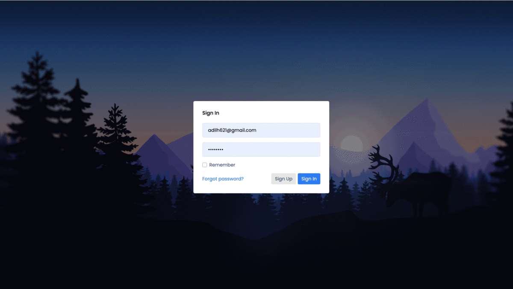

 
# 📂 Audit Proof

## Description

Created an innovative idea that could automate Client Data Management, A/R and order status directly from our current CMS. 
This feature would be integrated with our user dashboard, giving our clients the power of monitoring their invoices and service status 24/7 directly from their dashboards - from anywhere, anytime.


## User Story

```
As a SaaS, a start-up company, we often find ourselves 
allocating the majority of our budget on payroll, 
rather than automating some of the technical workflow to optimize 
efficiency, increase revenue and customer satisfaction.

```

## Application Demo:


## Hosted App:
The application is hosted on Heroku and can be found here https://finance-manages.herokuapp.com/

```
Credentials for entering App : adilh621@gmail.com : blahblah

```


## 💻 Technology Incorporated:
- mySQL / Sequelize
- Node.js
- Handlebars.js
- Express


